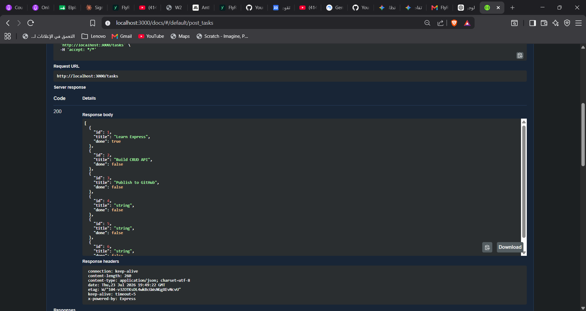
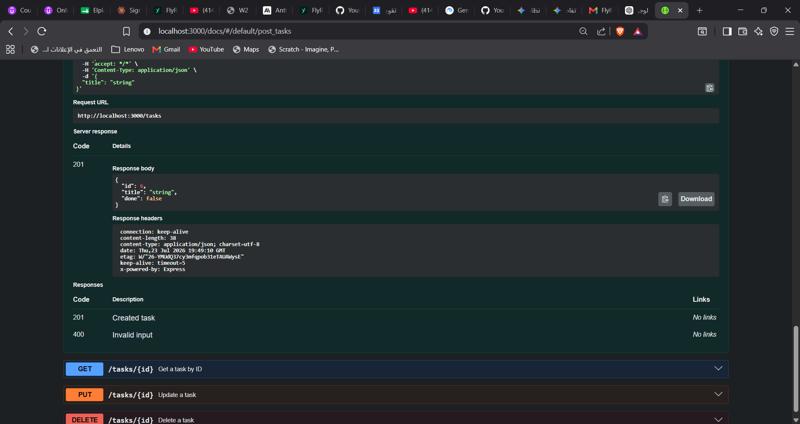

A simple, in-memory CRUD API for managing a to-do list, built with Node.js and Express. This project represents the submission for the FlyRank Internship Backend Track - Week 2 Assignment A1.

## How to Install & Run

1. Clone this repository to your local machine.
2. Install the required dependencies using npm:

```bash
   npm install

```

3. Start the server (it will run on port 3000):
```bash
npm start

```


4. Access the API at `http://localhost:3000` or view the interactive documentation at `http://localhost:3000/docs`.

## Endpoints

| HTTP Method | Endpoint | Description |
| --- | --- | --- |
| `GET` | `/` | Returns API metadata |
| `GET` | `/health` | Checks if the server is running |
| `GET` | `/tasks` | Lists all tasks |
| `GET` | `/tasks/:id` | Gets a single task by its ID |
| `POST` | `/tasks` | Creates a new task |
| `PUT` | `/tasks/:id` | Updates an existing task by its ID |
| `DELETE` | `/tasks/:id` | Deletes a task by its ID |

## Example curl Output

Here is an example of creating a new task using `curl`:

```bash
curl -i -X POST http://localhost:3000/tasks -H "Content-Type: application/json" -d "{\\"title\\":\\"Buy milk\\"}"

HTTP/1.1 201 Created
X-Powered-By: Express
Content-Type: application/json; charset=utf-8
Content-Length: 39
ETag: W/"27-K8eH6m4x+4M/n8T/p2u6Qj3z/8E"
Date: Thu, 23 Jul 2026 19:50:00 GMT
Connection: keep-alive
Keep-Alive: timeout=5

{"id":4,"title":"Buy milk","done":false}

```

## Swagger UI Screenshot

*
